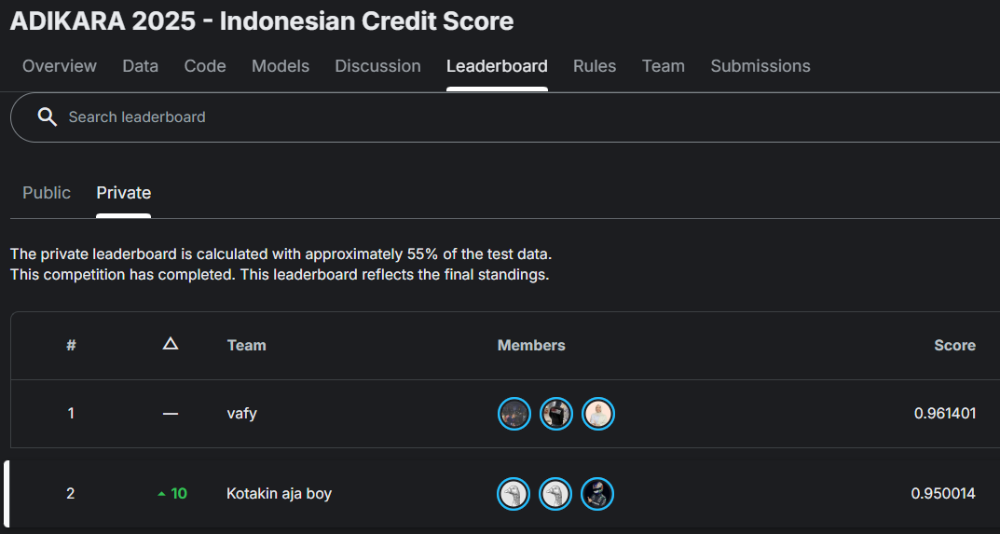
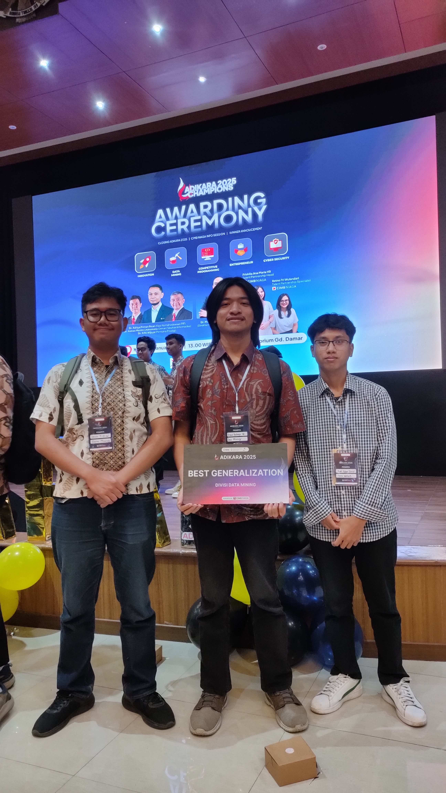

## Overview
Data Mining$-$ADIKARA is a data science competition held by PRODIGI for School of Computing of Telkom University. The core objective is to develop a robust Credit Scoring Model to predict the risk of borrower default based on historical loan transaction data.

About Competition:
- learning paradigm: supervised learning.
- task: binary classfication.
- dataset type: tabular.
## Methodology
- EDA: Robust exploration in order to feel the dataset pattern and charateristics.
- Pre-processing: Here we did a shopiscated approach in missing values primarily.
- Feature Engineering: Did a lot of feature creation based on domain knowledge and also its charateristics.
- Modeling: Focus on tree based and boosting.
- Evaluation: Ensure data leakage is prevented so that we can evaluate in a true way.
## Result
- Preliminary Round: Kaggle Competition
  - Leaderboard Jump: Successfully climbed from 12th position on the Public Leaderboard to 2nd position on the Private Leaderboard. This significant jump validates the effectiveness of our cross-validation strategy in preventing overfitting.
  - Metric Performance: Maintained a consistent Macro F1-Score of 95% across both public and private sets, ensuring high reliability in classification.
   

   
  <i>Figure 1: 2nd Place on Private Leaderboard</i>
 

- Final Round: Paper and Presentation
  - Award: Recognized with the Honorable Mention for Best Generalization. This award was specifically given for the model's ability to maintain high performance across diverse data distributions.
  - Announcement: [Official Announcement on Instagram](https://www.instagram.com/p/DTm-rCpCS7w/?img_index=6)
 

   
  <i>Figure 2: Honorable Mention for Best Generalization Award</i>
 

